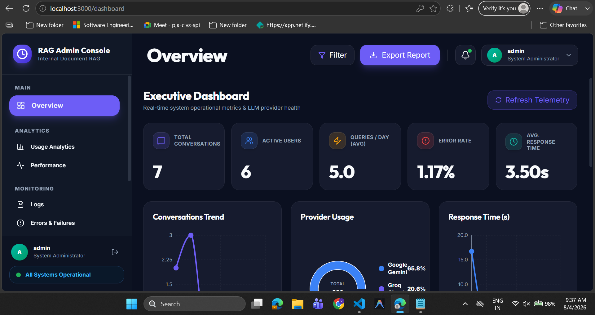
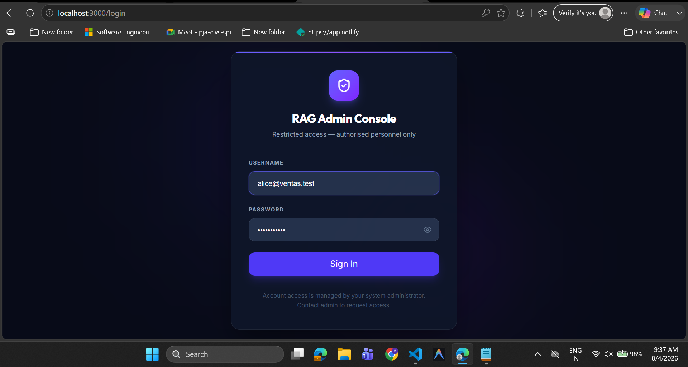
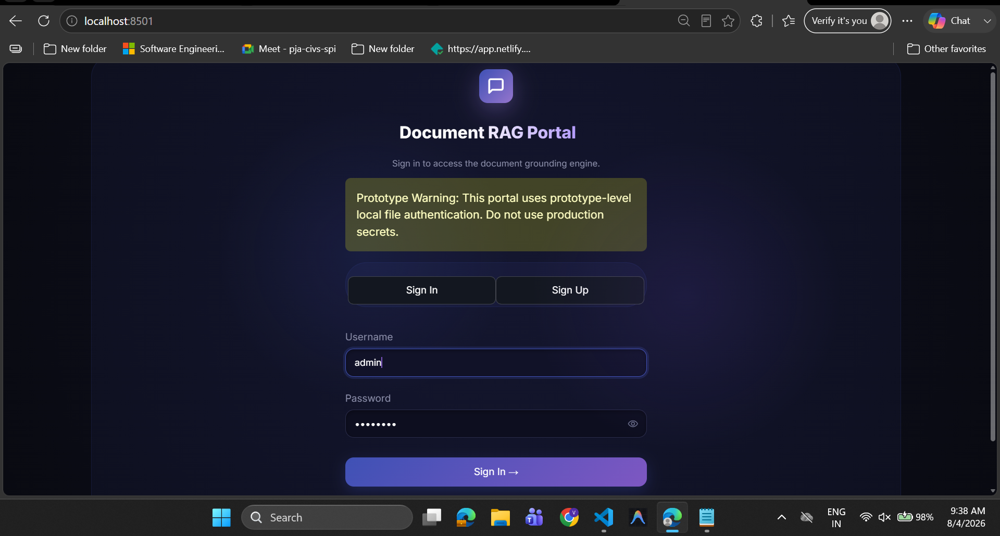
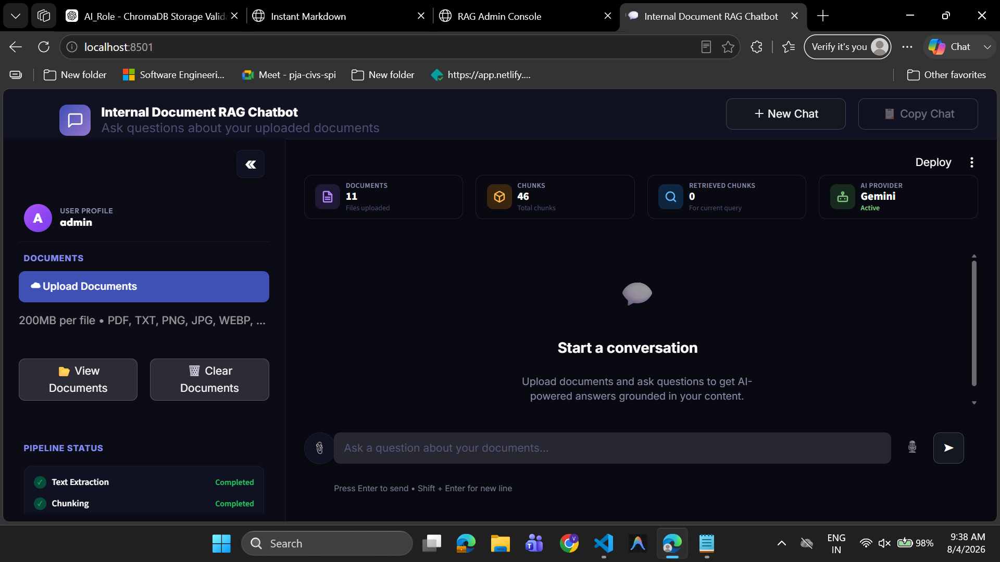

# RAG Chatbot Workspace

## Project Description

This repository contains two applications and one research/reference area:

- `apps/internal-document-rag` contains the Streamlit user application and the FastAPI backend.
- `apps/admin-console` contains the React admin console.
- `rnd` contains reference material used during the project.

The Streamlit application handles authentication, document upload, workspace loading, chat history, and question answering. The FastAPI application exposes admin-facing endpoints for authentication, dashboard data, analytics, monitoring, providers, settings, users, roles, API keys, and Excel export. The admin console consumes those API endpoints.

## Features

- Streamlit user interface with sign-in and sign-up flows.
- Local credential parsing from `USER_CREDENTIALS` and local user registration storage in `data/registered_users.json`.
- Document ingestion for `pdf`, `txt`, `png`, `jpg` and `jpeg`.
- PDF multimodal ingestion that combines text extraction, OCR, table extraction, and image caption generation.
- Chunk generation and 1024-dimensional vector embedding with `BAAI/bge-large-en-v1.5` / `BAAI/bge-m3`.
- Dual embedding backend support: PyTorch (`sentence-transformers`) and ONNX Runtime (`fastembed`) for zero-PyTorch execution in restricted AppLocker enterprise environments.
- ChromaDB storage for chunk embeddings and BM25 index maintenance for keyword hybrid retrieval.
- Query preprocessing, hybrid RRF retrieval, context building, and grounded answer generation.
- LLM routing across Groq, Gemini, and Ollama with provider health checks and circuit-breaker state.
- Per-user workspace directories, uploaded files, and chat history files.
- FastAPI admin endpoints under `/api/v1` for:
  - authentication
  - dashboard overview (with 100% dynamic 7-day sparkline analytics and live system health)
  - analytics (conversation volume, latency trends, and LLM provider share distribution)
  - monitoring logs, errors, warnings, and alerts
  - provider status and current provider
  - settings
  - users, roles, and API keys
  - Excel report export
- React admin console routes for login, dashboard, analytics, monitoring, providers, users, roles, API keys, integrations, and profile pages.
- Backend tests under `apps/internal-document-rag/tests` and frontend tests under `apps/admin-console/src/test`.

## Technology Stack

### Backend

- Python
- Streamlit
- FastAPI
- Uvicorn
- Pydantic
- ChromaDB
- fastembed (ONNX Runtime)
- sentence-transformers
- rank-bm25
- PyMuPDF
- pdfplumber
- pytesseract
- EasyOCR
- PaddleOCR / PaddlePaddle
- psutil
- openpyxl

### LLM and Retrieval Integrations

- Groq (`llama-3.3-70b-versatile`)
- Google Gemini (`gemini-2.5-flash`)
- Ollama (`qwen2.5:3b`, `llava:latest`)
- `BAAI/bge-m3` (1024 dimensions) for embeddings

### Frontend

- React
- TypeScript
- Vite
- Tailwind CSS
- Axios
- React Router
- Zustand
- Recharts
- Lucide React
- Sonner

### Testing and Tooling

- pytest
- Vitest
- Testing Library
- ESLint
- Black
- Ruff
- mypy
- Pyright

## High-Level Architecture

1. The Streamlit app starts from `apps/internal-document-rag/main.py` and renders the UI through `app/ui/streamlit_ui.py`.
2. User uploads are processed by `UploadService`, which routes PDF files through `MultimodalIngestionPipeline` and standalone image files through `ImageIngestionService`.
3. Extracted content is chunked, embedded via `FastEmbedModel` (ONNX engine), and indexed into ChromaDB and a BM25 index.
4. User questions are handled by `QueryService`, which retrieves relevant chunks via hybrid RRF search, builds prompt context, and calls `LLMRouter`.
5. `LLMRouter` selects Groq, Gemini, or Ollama based on configured provider order, health checks, and circuit-breaker state.
6. The FastAPI app in `apps/internal-document-rag/app/api/api_app.py` exposes admin-facing REST endpoints under `/api/v1`.
7. The React admin console calls those endpoints through Axios using `VITE_API_BASE_URL`.
8. Monitoring and analytics data are dynamically assembled by `DashboardService` and `AnalyticsRepository` from local runtime session files, ChromaDB state, hardware metrics, and backend log files.

## Project Workflow

### User Application Workflow

1. Start the Streamlit app.
2. Sign in or create a local account.
3. Upload supported files into the user workspace.
4. The backend stores files, extracts content, creates chunks, builds 1024-dim embeddings, and updates indexes.
5. Ask a question in the chat UI.
6. The retrieval layer searches ChromaDB and BM25, builds context, and sends it to the active LLM provider.
7. The answer is returned to the Streamlit interface with retrieved chunk data available in session state.

### Admin Console Workflow

1. Start the FastAPI app.
2. Start the React admin console.
3. Sign in through the admin console login page.
4. The frontend requests dashboard, analytics, monitoring, provider, settings, and user data from the FastAPI backend.
5. The backend composes dynamic responses from repositories and service classes in `apps/internal-document-rag/app/api`.

## Folder Structure

```text
RAG_Chatbot/
|-- apps/
|   |-- admin-console/
|   |   |-- public/
|   |   |-- src/
|   |   |   |-- app/
|   |   |   |-- features/
|   |   |   |-- services/
|   |   |   |-- shared/
|   |   |   |-- store/
|   |   |   `-- test/
|   |   |-- package.json
|   |   `-- vite.config.ts
|   `-- internal-document-rag/
|       |-- app/
|       |   |-- api/
|       |   |-- embeddings/
|       |   |-- ingestion/
|       |   |-- llm/
|       |   |-- models/
|       |   |-- ocr/
|       |   |-- retrieval/
|       |   |-- services/
|       |   |-- table/
|       |   |-- ui/
|       |   |-- utils/
|       |   |-- vectorstore/
|       |   `-- vision/
|       |-- docs/
|       |-- sample_docs/
|       |-- tests/
|       |-- main.py
|       |-- pyproject.toml
|       `-- requirements.txt
`-- rnd/
```

## Installation

### Backend

```powershell
cd apps/internal-document-rag
python -m venv venv
.\venv\Scripts\Activate.ps1
pip install -r requirements.txt
```

### Admin Console

```powershell
cd apps/admin-console
npm install
```

## Configuration

### Backend Configuration

1. Copy `apps/internal-document-rag/.env.example` to `apps/internal-document-rag/.env`.
2. Set the values required for your environment.

Important variables used by the code include:

- `APP_ENV`
- `USER_CREDENTIALS`
- `LLM_PROVIDER`
- `PRIMARY_PROVIDER`
- `SECONDARY_PROVIDER`
- `TERTIARY_PROVIDER`
- `GOOGLE_API_KEY`
- `GROQ_API_KEY`
- `GEMINI_MODEL_NAME`
- `GROQ_MODEL_NAME`
- `OLLAMA_URL`
- `OLLAMA_MODEL_NAME`
- `DATA_DIR`
- `UPLOAD_DIR`
- `CHAT_HISTORY_DIR`
- `CHROMA_DB_DIR`
- `CHROMA_COLLECTION_NAME`
- `MAX_UPLOAD_SIZE_MB`
- `CHUNK_SIZE`
- `CHUNK_OVERLAP`
- `EMBEDDING_MODEL_NAME`
- `EMBEDDING_BATCH_SIZE`
- `EMBEDDING_DIMENSION`
- `RETRIEVAL_TOP_K`
- `RETRIEVAL_MIN_SIMILARITY`
- `ENABLE_HYBRID_SEARCH`
- `SEMANTIC_TOP_K`
- `BM25_TOP_K`
- `RRF_K`

### Frontend Configuration

`apps/admin-console/.env.development` defines:

- `VITE_API_BASE_URL=http://localhost:8000/api/v1`

## Running the Application

### 1. Start the FastAPI backend

```powershell
cd apps/internal-document-rag
.\venv\Scripts\python.exe -m uvicorn app.api.api_app:app --host 0.0.0.0 --port 8000 --reload
```

### 2. Start the Streamlit user application

```powershell
cd apps/internal-document-rag
.\venv\Scripts\python.exe -m streamlit run main.py
```

### 3. Start the admin console

```powershell
cd apps/admin-console
npm run dev
```

Default local URLs:

- Streamlit user app: `http://localhost:8501`
- FastAPI docs: `http://localhost:8000/docs`
- Admin console: `http://localhost:3000`

## Screenshots

### Admin Console Dashboard


### Admin Console Login


### User Portal Login


### User Portal Dashboard



## Known Limitations

- The Streamlit application uses local file-based authentication and stores registered users in `data/registered_users.json`.
- The admin login endpoint validates usernames and passwords from `USER_CREDENTIALS`; the `/auth/me` check validates the token format rather than looking up a server-side session store.
- Monitoring and analytics views depend on local runtime files such as chat history JSON files and `data/logs/app.log`; empty or missing runtime files reduce the amount of data shown.
