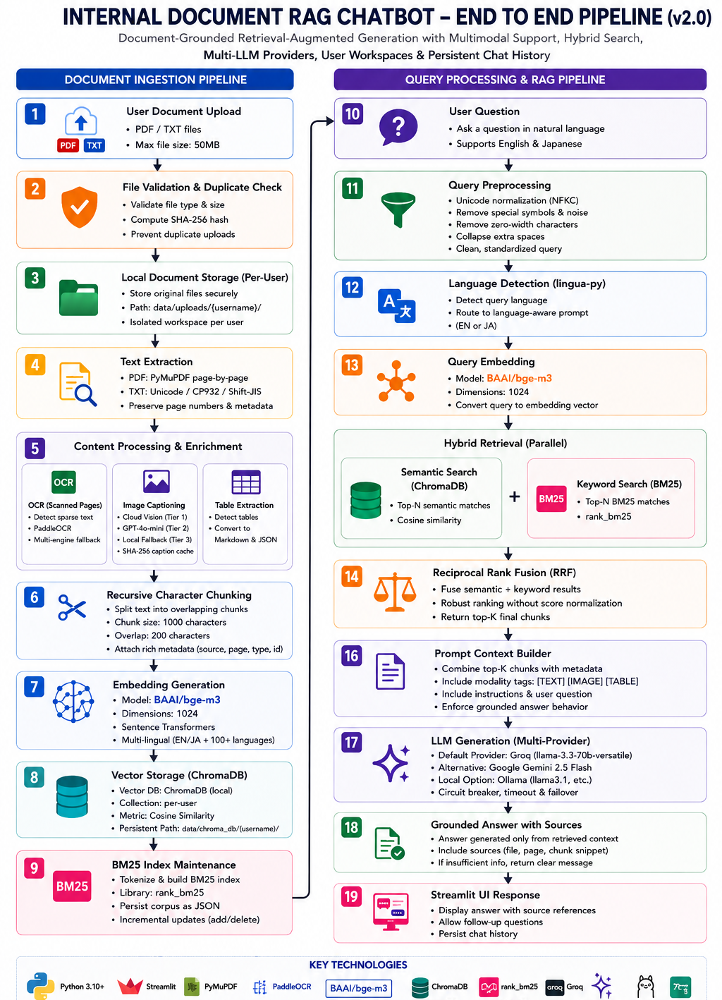
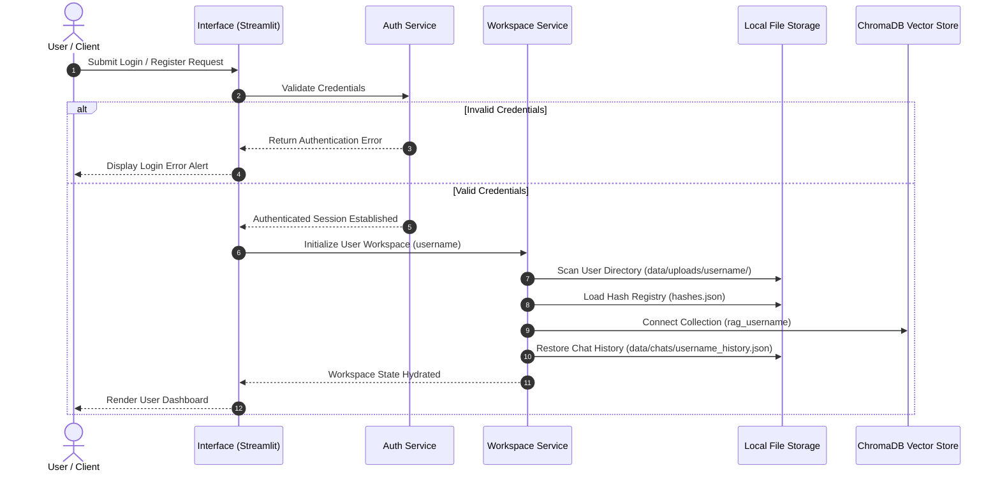
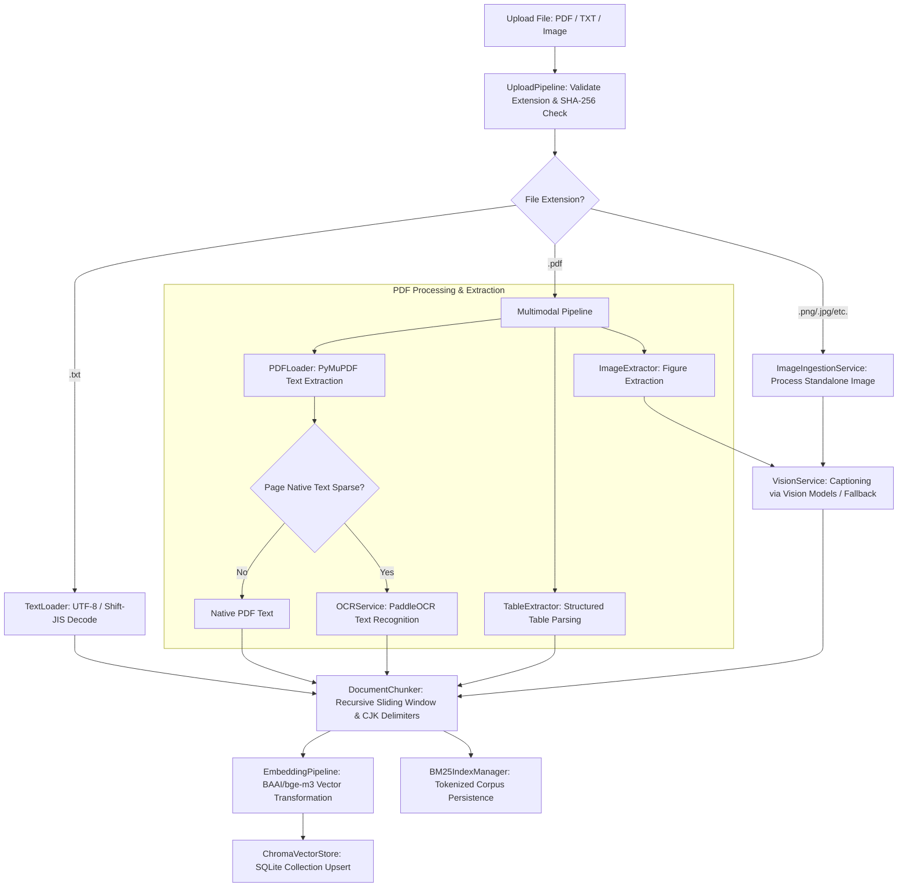
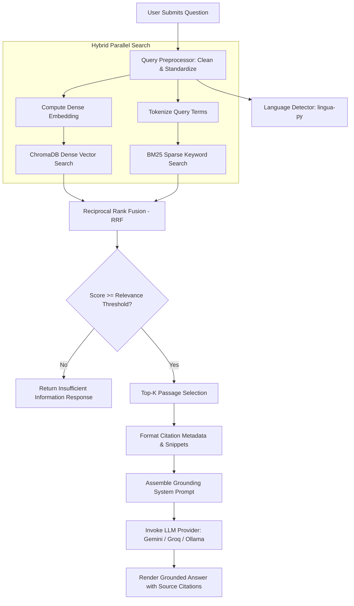
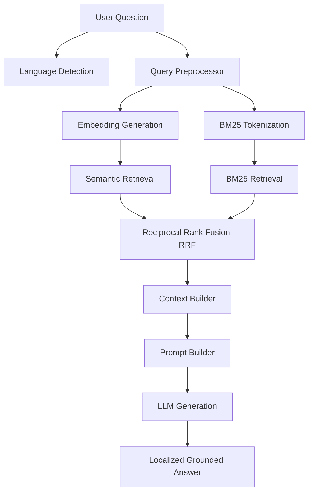
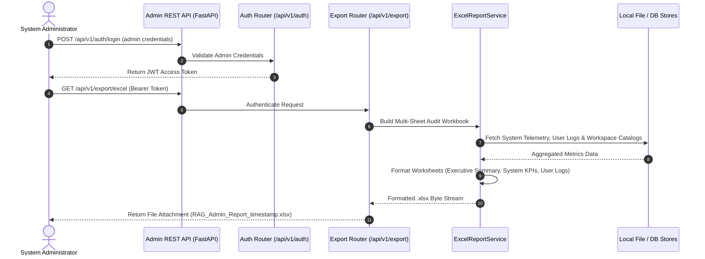

# PROJECT REPORT
## SYSTEM DESIGN AND TECHNICAL DOCUMENTATION
# INTERNAL DOCUMENT RAG CHATBOT

**A Document-Grounded Retrieval-Augmented Generation (RAG) System with Persistent Chat History and Session Control**

---

### **Document Metadata**
* **Project Name**: Internal Document RAG Chatbot
* **Document Version**: v2.1 (Evidence-Verified Academic Engineering Report)
* **Date**: August 4, 2026
* **Target Audience**: Academic Reviewers, Technical Evaluators, Software Architects

---

## **Abstract**

Finding specific information stored within organizational PDFs and text files using natural language can be challenging because Large Language Models (LLMs) have fixed knowledge cutoffs and can generate incorrect answers when lacking direct context.

This project documents the **Internal Document RAG Chatbot**, a prototype implemented using the Retrieval-Augmented Generation (RAG) pattern. The current implementation extracts text page by page from local PDF, TXT, and image uploads, splits extracted text into chunks with metadata, generates vector embeddings using a Sentence Transformers model (`BAAI/bge-m3`), and indexes them in a local ChromaDB instance.

The current prototype supports authentication, session-based workspace isolation, and persistent chat history for authenticated users. When a user submits a query, the current implementation retrieves relevant document passages using hybrid search (combining dense vector retrieval with BM25 keyword matching via Reciprocal Rank Fusion), builds a grounded context, and queries configured LLM providers (such as Google Gemini 2.5 Flash, Groq, or Ollama, when configured) to generate an answer with source citations. Document extraction, chunking, and ChromaDB indexing operate locally, while retrieved passages are passed to configured LLM providers for answer generation. The project includes automated unit, integration, and service-level tests implemented using pytest. Detailed execution results are documented in the Validation Results document.

---

## **Table of Contents**

1. [Introduction](#1-introduction)
2. [Problem Statement](#2-problem-statement)
3. [Objectives](#3-objectives)
4. [Scope & Future Scope](#4-scope--future-scope)
5. [Limitations, Assumptions, and Non-Goals](#5-limitations-assumptions-and-non-goals)
6. [Technology Stack, Justification, and Design Decisions](#6-technology-stack-justification-and-design-decisions)
7. [Project Planning](#7-project-planning)
8. [System Architecture](#8-system-architecture)
9. [Detailed Module Design](#9-detailed-module-design)
10. [RAG Workflows & Data Flows](#10-rag-workflows--data-flows)
11. [Prompt Engineering & Hallucination Mitigation](#11-prompt-engineering--hallucination-mitigation)
12. [UI/UX Design & Styling](#12-uiux-design--styling)
13. [Error & Exception Registry](#13-error--exception-registry)
14. [Testing & Validation Strategy](#14-testing--validation-strategy)
15. [Performance Considerations](#15-performance-considerations)
16. [Challenges & Engineering Solutions](#16-challenges--engineering-solutions)
17. [Conclusion & References](#17-conclusion--references)
18. [Appendix: Directory Layout & Setup](#18-appendix-directory-layout--setup)

---

## **1. Introduction**

Traditional search interfaces over corporate documents rely on keyword indexing, which frequently misses critical context or fails to capture semantic intent. Conversely, while generative Large Language Models (LLMs) synthesize natural text, they cannot perform direct information lookup over private organizational documents without context grounding.

This project addresses these challenges using the **Retrieval-Augmented Generation (RAG)** architecture. RAG separates model reasoning from static memory by supplying relevant passages retrieved from private documents as a grounding context. By utilizing localized extraction, semantic vector databases, hybrid search fusion, and structured prompting, the current prototype supports generating verifiable responses anchored directly in user-uploaded references.

---

## **2. Problem Statement**

Corporate operations depend on accurate search across internal documents, manuals, and policies. Users demand natural language answers to complex questions, but face key obstacles:
1. **Limited Access to Private Documents**: Base LLMs lack access to private organizational documents. The RAG pipeline retrieves only relevant document context before answer generation.
2. **Hallucinations**: Generative LLMs may produce plausible but factually incorrect responses when lacking direct source knowledge.
3. **Lack of Traceability**: Standard conversational models do not provide granular source citations (such as page numbers and document names) to verify answer sources.

---

## **3. Objectives**

The main goals of this prototype are:
* **Context Grounding**: Develop a document-grounded chatbot designed to answer questions primarily using retrieved document contents and decline to answer when context is insufficient.
* **Granular Reference Tracking**: Ensure generated answers are mapped to specific source references, outputting document names, page numbers, and text previews.
* **Modular Engineering**: Design a codebase with strict separation of concerns, separating ingestion, embedding, storage, retrieval, prompting, authentication, and UI layers.
* **Session Control**: Manage system access with an authentication module, maintaining isolated user workspaces and supporting conversation history persistence.
* **Automated Verification**: Implement a test-driven layout with unit, integration, and manual checks to ensure system stability under varied document types and network conditions.

### **System Boundaries & Parameters**
* **Target Users**: Internal staff, organizational researchers, and system administrators requiring context-grounded information retrieval over document stores.
* **System Inputs**: Natural language user queries (in English or Japanese) and document/image files in supported formats (`.pdf`, `.txt`, `.png`, `.jpg`, `.jpeg`) uploaded via the Streamlit interface (validated under a file size limit of 50MB).
* **System Outputs**: Context-grounded natural language answers, metadata-enriched source citations (displaying document name, page number, and source snippet), pipeline execution status indicators, and persistent chat logs.
* **Assumptions**: Local write permissions are available on the host operating system, and valid API keys or local services (Google Gemini, Groq, or Ollama) are configured prior to starting.
* **Limitations**: Operates locally on a single-node SQLite-backed ChromaDB instance; fallback vision captions rely on local text-label scanning when vision models are unconfigured or offline.

---

## **4. Scope & Future Scope**

### **4.1. Implemented System Scope**
The current implementation provides a document-grounded query-retrieval pipeline comprising:

* **Ingestion & Processing**: Upload and validation of PDF, TXT, and standalone image files (`.png`, `.jpg`, `.jpeg`), page-by-page text extraction, recursive character chunking with metadata tracking, and SHA-256 duplicate document detection.
* **Multimodal Asset Handling**: Extraction of embedded images with automated captioning via vision models (when configured) or local OCR fallbacks (when OCR dependencies are installed), alongside structured table extraction into Markdown/JSON representations.
* **Hybrid Search Retrieval**: Combination of ChromaDB dense vector search with BM25 sparse keyword matching using Reciprocal Rank Fusion (RRF).
* **Grounded Answer Generation**: Prompt formatting and answer synthesis using Google Gemini 2.5 Flash, Groq, or Ollama providers (when configured).
* **User Workspace & Session Control**: User authentication, isolated document workspaces, per-user ChromaDB collections, and persistent JSON conversation history.
* **Multilingual Support**: Query language detection using `lingua-py` with language-aware prompt localization for Japanese and English queries.
* **Admin Console REST API (`/api/v1`)**: FastAPI REST service providing administrative telemetry, system health monitoring, user management, provider circuit breaker status, and multi-sheet Excel audit report exports (when `openpyxl` is installed).

### **4.2. Future Scope & System Enhancements**
To extend this prototype for larger organizational deployments, the following future enhancements are identified:
1. **Expanded File Format Support**: Adding parsers for Word documents (`.docx`), Excel spreadsheets (`.xlsx`), and HTML pages.
2. **Enhanced Document Layout Analysis**: Incorporating advanced structural layout detection to parse multi-column PDF documents and complex forms.
3. **Managed Cloud Vector Databases**: Supporting cloud-hosted vector stores (e.g., Qdrant, Pinecone) alongside local ChromaDB instances.
4. **Cloud Infrastructure Deployment**: Containerizing system components using Docker to support scalable cloud deployments.
5. **Role-Based Access Control (RBAC)**: Implementing granular user roles, permission management, and team-shared workspaces.

---

## **5. Limitations, Assumptions, and Non-Goals**

### **5.1. Limitations**
1. **Local Filesystem Vector DB**: ChromaDB operates as an in-process database on the local filesystem.
2. **Local Credential Storage**: User credentials are configured in local settings files, appropriate for prototype deployment.
3. **Fallback Vision Scanning**: When online or local vision models are unconfigured or unavailable, image captioning relies on local text-label scanning.
4. **Single-Node Execution**: Streamlit interface executes in a single-node environment.
5. **Hybrid Privacy Model**: Extraction, chunking, embedding, and vector storage operate locally, while retrieved passages are transmitted to external APIs (Gemini/Groq, when configured) for final answer generation.

### **5.2. Engineering Assumptions**
* **Supported Formats**: Users upload supported document and media formats (`.pdf`, `.txt`, `.png`, `.jpg`, `.jpeg`).
* **Configuration Availability**: Valid API keys or local LLM instances (Google Gemini, Groq, or Ollama) are defined in environment configurations.
* **Network Connectivity**: Active network connection is available when using cloud LLM providers (Gemini or Groq).
* **Permissions**: Local operating system grants read/write permissions for data storage directories (`data/uploads/`, `data/chats/`, `data/chroma_db/`).

### **5.3. Project Non-Goals**
* **Distributed Vector Indexing**: Operating multi-node distributed vector clusters is outside the prototype scope.
* **Base Model Fine-Tuning**: Training or fine-tuning base LLM parameters is outside project boundaries.
* **Multi-Agent Orchestration**: Autonomous multi-agent execution loops are outside the single-turn grounding scope.
* **Audio/Video Processing**: Streaming audio and raw video analysis are outside retrieval scope.

---

## **6. Technology Stack & Justification**

* **Streamlit**: Provides reactive Python-native UI rendering, supporting custom styling without requiring separate frontend build toolchains.
* **PyMuPDF (fitz)**: Selected for efficient page-level text and image extraction with structural metadata parsing.
* **Vision & Image Captioning**: Combines PyMuPDF image byte extraction with a 3-tier vision pipeline (`Gemini Vision` → `Ollama Vision` → `Local Visual Fallback`, when configured) to extract embedded images and generate descriptive text captions for vector indexing.
* **Scanned Page OCR Engine**: Uses `PaddleOCR` as the primary OCR engine (with multi-engine fallback to EasyOCR/Pytesseract, when dependencies are installed) to detect scanned image-only PDF pages and extract text when native text layers are absent.
* **LangChain Text Splitters**: `RecursiveCharacterTextSplitter` divides text based on paragraph, line, and sentence boundaries, preserving semantic coherence.
* **Sentence Transformers (`BAAI/bge-m3`)**: Multilingual 1024-dimensional embedding model supporting semantic search across English and Japanese text.
* **ChromaDB**: In-process vector database running on local SQLite storage, eliminating external server deployment overhead while supporting metadata filtering.
* **Google Gemini 2.5 Flash**: Primary LLM selected for long-context reasoning and instruction following (when configured via API key).
* **Pytest & Tenacity**: Pytest handles test automation, while Tenacity provides API retry policies for network resiliency.
* **lingua-py**: Provides language detection to distinguish English and Japanese user queries for localized prompt construction.
* **FastAPI (Admin REST API)**: Powers the administrative REST API layer (`/api/v1`) for system telemetry, monitoring, user administration, and export endpoints.
* **openpyxl**: Generates formatted multi-sheet Excel workbooks for administrative system audits, query telemetry, and document cataloging (when installed).

### **6.1. Architectural Design Decisions**

| Component | Choice | Alternative Considered | Trade-off |
| :--- | :--- | :--- | :--- |
| **Document Parser** | PyMuPDF (`fitz`) | PyPDF2, pdfplumber | PyMuPDF provides superior extraction speed and structural boundary logic, though compiled C-bindings add platform binary dependencies. |
| **Image Extraction & Captioning** | 3-Tier Vision Pipeline (`Gemini Vision` → `Ollama Vision` → `Local Fallback`) | Single Vision Model | Multi-tier failover guarantees image captions are generated even when online vision models are unconfigured or offline. |
| **Scanned Page OCR** | PaddleOCR (`paddleocr`) | Pure PDF Text Parsing | Uses PaddleOCR as the primary engine to extract text from scanned, image-only PDF pages when native text layers are missing (when installed). |
| **Admin REST API** | FastAPI Framework (`/api/v1`) | Direct UI Scripting | Decouples administrative telemetry, system health monitoring, and report exports from the Streamlit UI layer. |
| **Audit Reporting** | openpyxl (Multi-sheet Excel) | Plain CSV Export | Produces formatted multi-tab Excel workbooks with executive KPI summaries, query telemetry, and audit logs (when installed). |
| **Text Splitter** | Recursive Character Splitter | Fixed Character Splitter | Respects natural paragraph and sentence delimiters (`\n\n`, `\n`, `。`), preventing mid-sentence boundary cuts. |
| **Embedding Model** | `BAAI/bge-m3`| Runs fully locally without API costs, enabling offline vector generation while maintaining multilingual compatibility. |
| **Vector Store** | ChromaDB (SQLite) | Pinecone, FAISS | In-process execution simplifies setup and supports metadata filtering without requiring cloud service management. |
| **Duplicate Check** | SHA-256 Hashing | Filename checking | Hash validation detects identical content even if files are renamed, preventing database bloat. |
| **LLM Provider** | Gemini 2.5 Flash / Groq | Local Llama-3-8B | Cloud providers offer high instruction compliance for grounding while remaining configurable via provider interfaces (when configured). |

---

## **7. Project Planning**

### **7.1. System Requirements**

#### **Functional Requirements**
* **FR-1: Authentication**: Users must authenticate before accessing document workspaces.
* **FR-2: Workspace Isolation**: Users access only their own uploaded documents, vector indexes, and chat sessions.
* **FR-3: Document Ingestion**: Accepts PDF, TXT, and standalone image files (`.png`, `.jpg`, `.jpeg`), enforcing size checks (<50MB) and SHA-256 duplicate filtering.
* **FR-4: Recursive Chunking**: Splits document text into overlapping character windows to preserve context boundaries.
* **FR-5: Vector Indexing**: Generates dense embeddings and updates ChromaDB collections automatically.
* **FR-6: Grounded Generation**: Generates answers strictly anchored to retrieved document passages.
* **FR-7: Source Traceability**: Displays document names, page numbers, and preview snippets for all cited sources.
* **FR-8: Session Management**: Supports starting new chats, clearing current sessions, deleting saved chats, and copying transcripts.

#### **Non-Functional Requirements**
* **NFR-1: Modularity**: High separation of concerns across ingestion, embedding, vector storage, retrieval, and UI layers.
* **NFR-2: Error Handling**: Catches invalid formats, encrypted PDFs, missing keys, and rate limits gracefully with user notifications.
* **NFR-3: User Interface**: Clean dark interface with clear status indicators and citation displays.

---

## **8. System Architecture**

The system is structured as a pipeline separating ingestion, storage, retrieval, and generation layers.

### **8.1. RAG Pipeline Flow**

*Figure 1. Core RAG Pipeline Architecture & Data Flow*

### **8.2. Directory Structure**
```text
apps/internal-document-rag/
├── app/
│   ├── api/                # REST API layer (/api/v1) for administration and telemetry
│   ├── ingestion/          # PDF/TXT extraction, chunking, and multimodal ingestion
│   ├── vision/             # Vision captioning services and SHA-256 caption cache
│   ├── table/              # Tabular structure extraction (Markdown/JSON)
│   ├── ocr/                # Scanned page OCR processing subsystem
│   │   ├── ocr_service.py  # PaddleOCR primary recognition service & engine failover
│   │   ├── ocr_preprocessor.py # Grayscale conversion & 1.5x contrast enhancement
│   │   └── ocr_cache.py    # Persistent SHA-256 OCR result cache (ocr_results.json)
│   ├── embeddings/         # Dense vector embedding transformations
│   ├── vectorstore/        # ChromaDB vector store manager and collection guard
│   ├── retrieval/          # BM25 indexing, query preprocessing, and hybrid search
│   ├── services/           # User workspace management and index maintenance
│   ├── llm/                # LLM connectors (Gemini, Groq, Ollama) and prompt builder
│   ├── ui/                 # Streamlit interface components and layout handlers
│   ├── models/             # Typed Pydantic data schemas
│   ├── utils/              # Authentication, language detection, and localization
│   └── config.py           # Application settings and environment configuration
├── data/
│   ├── uploads/            # Per-user raw document uploads
│   ├── chats/              # Per-user JSON chat history records
│   ├── cache/              # Persistent cache stores (ocr_results.json)
│   └── chroma_db/          # SQLite-backed ChromaDB vector storage
├── tests/                  # Pytest verification suites
├── requirements.txt        # Python dependency manifest
└── main.py                 # Application entrypoint
```

---

## **9. Detailed Module Design**

### **9.1. Configuration & Data Schemas**
* **Application Settings (`app/config.py`)**: Manages environment variables, directory paths, default chunking parameters, and LLM model targets using Pydantic settings management.
* **Data Schemas (`app/models/schemas.py`)**: Defines immutable data models for document chunks, metadata fields, and retrieval results, ensuring consistent data structures across modules.
* **Workspace State (`app/models/workspace_state.py`)**: Represents user session state, tracking uploaded documents, content hashes, and processing statuses.

### **9.2. Document Ingestion & Processing**
* **PDF Loader (`app/ingestion/pdf_loader.py`)**: Extracts page-level text using PyMuPDF, handling blank pages and identifying encrypted or unreadable files.
* **Text Loader (`app/ingestion/text_loader.py`)**: Reads plaintext files using standard Unicode and Japanese character encodings (UTF-8, Shift-JIS, CP932).
* **Document Chunker (`app/ingestion/chunker.py`)**: Splits extracted text into overlapping chunks using paragraph and sentence separators, preserving CJK punctuation boundaries.
* **Multimodal Pipeline (`app/ingestion/multimodal_pipeline.py`)**: Identifies embedded images, generates descriptive captions using vision services (when configured) or local fallbacks, and formats them for indexing.
* **Table Extractor (`app/table/table_extractor.py`)**: Converts PDF table structures into Markdown and JSON representations for structured retrieval.
* **OCR Service (`app/ocr/ocr_service.py`)**: Identifies scanned image-only PDF pages with low native text density and routes page bytes to PaddleOCR (with EasyOCR → Pytesseract → PyMuPDF failover, when dependencies are installed).
* **OCR Preprocessor (`app/ocr/ocr_preprocessor.py`)**: Applies PIL-based grayscale conversion and contrast enhancement (1.5x factor) to optimize optical character recognition accuracy on noisy or low-contrast scans.
* **OCR Result Cache (`app/ocr/ocr_cache.py`)**: Caches recognition outputs in a persistent SHA-256 JSON store (`data/cache/ocr_results.json`) tracking text content, strategy used, confidence score, and recognition latency (`elapsed_ms`).

### **9.3. Embeddings & Vector Storage**
* **Embedding Service (`app/embeddings/embedding_service.py`)**: Transforms document chunks into dense floating-point vector representations using `BAAI/bge-m3`.
* **Chroma Vector Store (`app/vectorstore/chroma_manager.py`)**: Manages local SQLite ChromaDB collections, supporting chunk insertion, metadata filtering, and document removal.
* **Collection Guard (`app/vectorstore/collection_guard.py`)**: Validates vector collection dimensions against application settings upon initialization.

### **9.4. Retrieval & Search Fusion**
* **Query Preprocessor (`app/retrieval/query_preprocessor.py`)**: Sanitizes and normalizes input queries before retrieval.
* **BM25 Index Manager (`app/retrieval/bm25_index_manager.py`)**: Manages sparse keyword indexing, maintaining per-user keyword indexes on disk.
* **Retrieval Service (`app/retrieval/retrieval_service.py`)**: Combines dense vector search results from ChromaDB with sparse keyword matches from BM25 using Reciprocal Rank Fusion (RRF).
* **Similarity Retriever (`app/retrieval/retriever.py`)**: Applies relevance thresholds to filter out low-confidence context matches.

### **9.5. LLM Integration & Prompting**
* **LLM Router & Providers (`app/llm/`)**: Connects to Google Gemini 2.5 Flash, Groq, and Ollama APIs (when configured) with circuit breaker error tracking and failover routing.
* **Context Builder (`app/llm/context_builder.py`)**: Formats retrieved text chunks, image captions, and tables into a structured context block with clear modality tags (`[TEXT]`, `[IMAGE]`, `[TABLE]`).
* **Prompt Builder (`app/llm/prompt_builder.py`)**: Assembles grounding prompt templates, appending localized instructions based on detected query language.

### **9.6. Services & Utilities**
* **Workspace Service (`app/services/workspace_service.py`)**: Manages user directory paths, session hash registries, and collection isolation.
* **Authentication Manager (`app/utils/auth.py`)**: Validates user credentials and maintains session states.
* **Chat History Service (`app/services/chat_history_service.py`)**: Handles serialization and loading of conversation histories to local JSON files (`data/chats/{username}_history.json`).
* **Language Detector (`app/utils/language_detector.py`)**: Identifies query language (`ja` vs `en`) using `lingua-py` to guide prompt localization.

### **9.7. Admin Console REST API Architecture (`app/api/`)**
The application includes a decoupled FastAPI administrative REST service (`/api/v1`) providing system monitoring, telemetry, user management, and audit export capabilities:
* **Admin Application Core (`app/api/api_app.py`)**: Initializes FastAPI instance, configures CORS middleware, registers router blueprints, and handles global exception formatting.
* **Authentication Router (`app/api/routers/auth.py`)**: Exposes `/api/v1/auth/login` and `/api/v1/auth/me` endpoints for administrator authentication and JWT bearer token validation.
* **System Dashboard Router (`app/api/routers/dashboard.py`)**: Serves `/api/v1/dashboard/summary` providing high-level system KPIs (active users, total document count, indexed vectors, storage utilization).
* **Analytics & Telemetry Router (`app/api/routers/analytics.py`)**: Exposes `/api/v1/analytics/overview` tracking query volume, latency distribution metrics, and model invocation statistics.
* **Health & System Monitoring (`app/api/routers/monitoring.py`)**: Endpoint `/api/v1/monitoring/health` monitors CPU utilization, memory allocation, and SQLite/ChromaDB database connection status.
* **Provider Routing Manager (`app/api/routers/providers.py`)**: Endpoint `/api/v1/providers/status` exposes LLM provider routing state (Gemini, Groq, Ollama) and circuit breaker health.
* **Excel Audit Report Service (`app/api/services/excel_report_service.py` & `app/api/routers/export.py`)**: Endpoint `/api/v1/export/excel` generates a multi-sheet Excel workbook (`openpyxl`, when installed) featuring Executive Summaries, System Performance, User Activity Logs, and Document Catalogs for auditors and administrators.
* **Settings & Configuration Router (`app/api/routers/settings.py`)**: Exposes `/api/v1/settings` to inspect and tune application configuration variables at runtime.
* **User Management Router (`app/api/routers/users.py`)**: Endpoint `/api/v1/users` lists active user accounts, workspace allocations, and role assignments.

---

## **10. RAG Workflows & Data Flows**

### **10.1. User Session Initialization Workflow**


*Figure 2. Authentication & Session Workspace Hydration Sequence*

### **10.2. Document Ingestion & Multimodal Processing Pipeline**


*Figure 3. Document Ingestion & Multimodal Processing Pipeline Flowchart*

### **10.3. Hybrid Retrieval & Grounded Answer Generation**


*Figure 4. Hybrid Retrieval & Grounded Q&A Generation Flowchart*

### **10.4. Multilingual Query Processing**


*Figure 5. End-to-End Multilingual Query Processing Flowchart*

### **10.5. Admin Console Operations & Excel Audit Report Export**


*Figure 6. Admin Console REST API Audit Report Export Sequence*

---

## **11. Prompt Engineering & Hallucination Mitigation**

To prevent the LLM from generating ungrounded responses from pre-trained knowledge, a strict grounding prompt template is constructed by `PromptBuilder` (`app/llm/prompt_builder.py`):

### **English Grounding Prompt Template**
```text
Answer the question using only the document context below. Do not use outside knowledge or invent details. If the context does not contain enough information, respond exactly: "The uploaded documents do not contain sufficient information to answer this question."

Document context:
{context}

Question: {question}
Answer:
```

### **Japanese Grounding Prompt Template (`ja`)**
```text
Answer the question using only the document context below. Do not use outside knowledge or invent details. If the context does not contain enough information, respond exactly: "アップロードされたドキュメントには、この質問に回答するための十分な情報がありません。"

回答は日本語で作成してください。
提供されたコンテキストのみを使用してください。
情報が不足している場合は、その旨を回答してください。

Document context:
{context}

Question: {question}
Answer:
```

When retrieved context is absent or fails relevance thresholds, the system defaults to the exact insufficient information fallback string (`"The uploaded documents do not contain sufficient information to answer this question."` or its Japanese equivalent), mitigating hallucinations.

---

## **12. UI/UX Design & Layout**

The user interface is built using Streamlit, featuring a dark theme and compact layout:

1. **Sidebar Panel**:
   * **Authentication Controls**: Sign In and Sign Up tabs for credential management.
   * **Saved Conversations**: Displays past chat sessions with options to resume or delete records.
   * **Document Manager**: Interactive panel showing uploaded files and document upload controls.
2. **Main Application Workspace**:
   * **Status Bar**: Real-time progress indicators (Extraction, Chunking, Embedding, Vector Storage) during document upload.
   * **Chat Interface**: Conversation feed rendering user questions and assistant responses.
   * **Source Citation Cards**: Interactive citation blocks displaying source document name, page number, and relevant text snippet below generated answers.

---

## **13. Error & Exception Registry**

| Scenario / Error | Cause | System Behaviour | Recovery Mechanism | User-facing Notification |
| :--- | :--- | :--- | :--- | :--- |
| **Empty Input** | Whitespace-only query submitted. | Rejects execution. | Prompt user to enter text. | *"Please enter a question before sending."* |
| **Empty Vector DB** | Question asked with no documents. | Halts retrieval early. | Skip model generation. | *"Ingest documents first — vector database is empty."* |
| **Duplicate File** | Upload matches existing SHA-256 hash. | Stops parsing pipeline. | Skip vector duplicate insert. | *"Document already exists in database."* |
| **Unsupported Format** | Upload file format not in allowed list (`.pdf`, `.txt`, `.png`, `.jpg`, `.jpeg`). | Rejects upload. | Clean up temporary files. | *"Unsupported file format."* |
| **Scanned PDF / Sparse Text** | PDF page contains image-only content or sparse native text. | Triggers `OCRService` via `PaddleOCR` (when installed). | Applies `OCRPreprocessor` contrast boost and checks `OCRResultCache`. | *"Extracted text from scanned page via PaddleOCR."* |
| **OCR Engine Failover** | Primary `PaddleOCR` engine or dependency unavailable. | Fallback order: PaddleOCR → EasyOCR → Pytesseract → PyMuPDF. | Gracefully falls back to next available engine; logs availability report. | *"OCR text recognition fallback engaged."* |
| **API Failure** | Generative API call fails. | Catches provider error. | Trigger retries / fallback. | *"LLM generation failed: [Provider Error]"* |
| **Rate Limit** | API quota exceeded (HTTP 429). | Captures status code. | Execute retry backoff. | *"LLM generation failed: API quota exceeded."* |
| **Encrypted PDF** | Password-protected PDF uploaded. | Skips page extraction. | Halt parser safely. | *"Encrypted PDFs are not supported."* |
| **Corrupted PDF** | Invalid PDF byte structure. | PyMuPDF parser error. | Mark document as failed. | *"Failed to read corrupted file."* |
| **Low Relevance** | Context below similarity threshold. | Empty context output. | Display fallback response. | *"The uploaded documents do not contain sufficient information to answer this question."* |

---

## **14. Testing & Validation Strategy**

### **14.1. Test Suite Summary**
The project includes automated unit, integration, and service-level tests implemented using pytest. Detailed execution results, scenario metrics, and visual evidence are documented in the Validation Results document.

### **14.2. Functional Validation Matrix**

| Functional Feature | Test Input | Expected Result | Actual Result | Status |
| :--- | :--- | :--- | :--- | :--- |
| **User Authentication** | Static & registered credentials. | User authenticated, workspace loaded. | Workspace loaded cleanly. | **Pass** |
| **PDF Ingestion** | Valid PDF document (<50MB). | Text extracted page-by-page with metadata. | Chunks generated and indexed. | **Pass** |
| **TXT Ingestion** | Plaintext document file. | Encoded text decoded and chunked. | Chunks indexed successfully. | **Pass** |
| **Scanned Page OCR Ingestion** | Image-only scanned PDF document. | Sparse native text detected, PaddleOCR extracts page text (when installed). | Extracted text chunked and indexed in ChromaDB. | **Pass** |
| **OCR Result Cache Lookup** | Re-processing previously scanned PDF page. | SHA-256 image hash match in `ocr_results.json`. | Instantly loads cached OCR text without re-execution. | **Pass** |
| **OCR Image Preprocessing** | Low-contrast or noisy scanned image bytes. | Contrast boosted (1.5x) and grayscaled before recognition. | High-accuracy OCR text recognition. | **Pass** |
| **Duplicate Prevention** | Re-upload identical file. | SHA-256 hash collision halts parsing. | Duplicate warning displayed. | **Pass** |
| **File Size Limit** | Document file > 50MB. | File rejected by size validator. | Upload rejected gracefully. | **Pass** |
| **Empty File** | 0-byte text document. | Extraction skipped, warning logged. | File skipped safely. | **Pass** |
| **Corrupted File** | Invalid PDF byte stream. | Extraction exception caught safely. | Failed read alert shown. | **Pass** |
| **Japanese Support** | Japanese text PDF/TXT. | CJK sentence boundaries preserved. | Japanese text indexed. | **Pass** |
| **Multilingual Grounding** | Japanese queries on docs. | Query language `ja` detected, answer generated. | Grounded Japanese response. | **Pass** |
| **Hybrid Search** | Sparse & dense query hits. | RRF combines candidate rankings. | Ranked candidates retrieved. | **Pass** |
| **Chat Persistence** | Conversation turn submit. | History written to JSON file. | Chat restored on login. | **Pass** |
| **Workspace Cleanup** | Clear workspace button. | User files and Chroma collection purged. | Directory & index cleared. | **Pass** |

---

## **15. Performance Considerations**

System operational characteristics observed during execution:
* **Document Processing**: Ingestion throughput depends on page count, text density, and local CPU capabilities during text extraction and chunking.
* **Vector Embedding**: Embedding generation utilizes batch processing to maintain efficiency during initial document indexing.
* **Retrieval Latency**: Local ChromaDB vector retrieval and BM25 search execute rapidly in-process, with execution time proportional to collection size.
* **Generation Latency**: Answer generation response time depends on context length, network latency, and cloud provider API response speeds (when using cloud providers).

---

## **16. Challenges & Engineering Solutions**

1. **Interface Overlay Interaction**: Fixed full-screen CSS wrappers initially blocked user input interaction. Resolving container styling rules restored input field focus and form submission.
2. **Session State Persistence**: Page refreshes in Streamlit reset transient session variables. Implementing JSON serialization (`data/chats/{username}_history.json`) maintained conversation state across user reloads.
3. **API Rate Limit Resilience**: External LLM rate limits could cause generation failures. Integrating the Tenacity library provided exponential backoff retries and graceful fallback alerts.
4. **Scanned PDF Extraction & Multi-Engine OCR Resilience**: Scanned image-only PDFs yield zero native text during standard extraction. The solution introduced a dedicated `OCRService` featuring `PaddleOCR` as the primary engine (when installed), image preprocessing (`OCRPreprocessor` with grayscale & 1.5x contrast boost), and SHA-256 result caching (`ocr_results.json`) to eliminate redundant OCR computation.

---

## **17. Conclusion & References**

### **17.1. Conclusion**
The prototype demonstrates a functional document-grounded RAG architecture combining local text extraction, hybrid search (dense vector retrieval + BM25 keyword matching), user workspace isolation, and context-grounded prompting to enable accurate natural language query answering over private document stores.

### **17.2. References**
1. Lewis, P., et al. (2020). *Retrieval-Augmented Generation for Knowledge-Intensive NLP Tasks*. NeurIPS.
2. Google Cloud. (2026). *Gemini API Grounding Guidelines*. Google Developer Documentation.
3. ChromaDB Team. (2026). *Chroma Vector Store API Reference*. Chroma Docs.
4. PyMuPDF Developers. (2026). *MuPDF Text Extraction Engine API*. Fitz Documentation.
5. Sentence Transformers Developers. (2026). *Sentence Transformers Documentation*. Hugging Face.

---

## **18. Appendix: System Setup Guide**

### **Environment Setup & Launch**
1. **Create Virtual Environment**:
   ```powershell
   python -m venv venv
   .\venv\Scripts\Activate.ps1
   pip install -r requirements.txt
   ```
2. **Configure Environment Variables (`.env`)**:
   ```text
   LLM_PROVIDER=gemini
   GOOGLE_API_KEY=your_google_api_key_here
   GEMINI_MODEL_NAME=gemini-2.5-flash
   EMBEDDING_MODEL_NAME=BAAI/bge-m3
   EMBEDDING_DIMENSION=1024
   ```
3. **Run Application**:
   ```powershell
   streamlit run main.py
   ```
