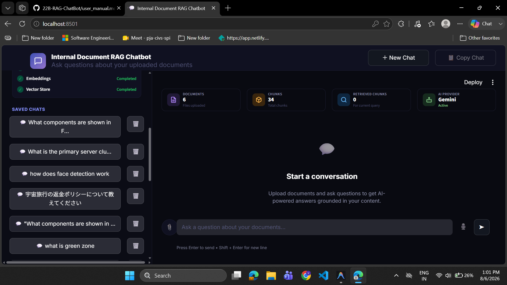
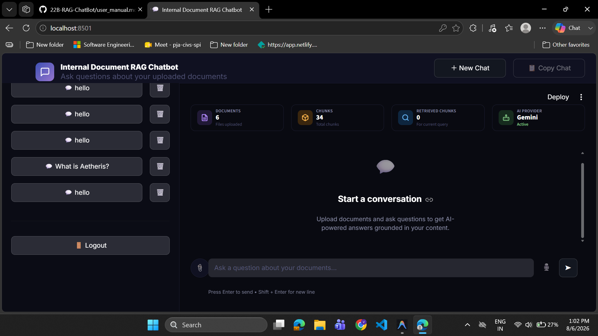

# USER MANUAL
## INTERNAL DOCUMENT RAG PORTAL

**A Step-by-Step Operator Guide for Accessing, Managing, and Querying Grounded Documents**

---

### **Document Information**
* **Project Name**: Internal Document RAG Chatbot
* **Document Version**: v2.2 (User Operations Manual)
* **Date**: August 4, 2026
* **Target Audience**: End Users, System Operators, and Reviewers

---

## **Table of Contents**
1. [Introduction & Core Concept](#1-introduction--core-concept)
2. [Supported File Types](#2-supported-file-types)
3. [Prerequisites & System Requirements](#3-prerequisites--system-requirements)
4. [Launching the Application](#4-launching-the-application)
5. [Accessing the Portal: User Login & Registration](#5-accessing-the-portal-user-login--registration)
6. [Navigating the User Dashboard](#6-navigating-the-user-dashboard)
7. [Managing Documents](#7-managing-documents)
8. [Interacting with the Chatbot](#8-interacting-with-the-chatbot)
9. [Managing Conversations & Chat History](#9-managing-conversations--chat-history)
10. [Admin Console Overview](#10-admin-console-overview)
11. [Common Messages](#11-common-messages)
12. [Troubleshooting & FAQ](#12-troubleshooting--faq)

---

## **1. Introduction & Core Concept**

The **Internal Document RAG Portal** is a web-based chat assistant that allows you to upload document files and ask questions using natural language.

When you ask a question, the application searches your uploaded files for relevant information and returns an answer grounded in those passages, alongside source reference cards.

---

## **2. Supported File Types**

The application accepts the following file types:

| Category | Format | Extension | Notes |
| :--- | :--- | :--- | :--- |
| **Documents** | PDF | `.pdf` | Standard text and scanned PDF documents |
| **Documents** | Text | `.txt` | Plaintext files (UTF-8, Shift-JIS, CP932 encodings) |
| **Images** | PNG / JPG | `.png`, `.jpg`, `.jpeg` |
* **File Size Limit**: Up to **50MB** per file (validated prior to ingestion).

---

## **3. Prerequisites & System Requirements**

To use the portal:

* **Web Browser**: A modern web browser is recommended.
* **Network Connection**: Local network or internet connection (required when using cloud LLM providers).
* **Login Credentials**: Username and password assigned by your administrator or registered via the sign-up tab.

---

## **4. Launching the Application**

To access the portal:

* Open the application URL provided by your administrator (for example, `http://localhost:8501`).

---

## **5. Accessing the Portal: User Login & Registration**

When you open the portal, the login page is displayed. Main workspace features are hidden until you log in.

### **Logging In**
1. Click the **👤 Sign In** tab.
2. Enter your username and password.
3. Click **Sign In →**. When valid, your personal workspace loads automatically.

### **Registering a New Account**
When account registration is enabled:
1. Click the **👤+ Sign Up** tab.
2. Enter a username, password, and confirm your password.
3. Click **Create Account →**. Your user account will be created and your workspace initialized.

---

## **6. Navigating the User Dashboard**

Once logged in, the interface displays:

1. **Sidebar Panel** (Left):
   * **Profile**: Displays your logged-in username.
   * **Upload Box**: Area to drop or select files.
   * **Select Document**: Dropdown list to select an uploaded file.
   * **Saved Conversations**: List of stored past chat sessions.
   * **Action Buttons**: **➕ New Chat**, **🗑️ Clear Workspace**, and **🚪 Sign Out**.
2. **Main Workspace** (Right):
   * **Header Toolbar Badges**: Displays live metrics for **Documents** (count of uploaded files), **Chunks** (total indexed text segments), **Retrieved Chunks** (for current query), and **AI Provider** status (**Active** or **Unavailable**).
   * **Chat Feed**: Scrollable message history showing user queries and assistant responses.
   * **Query Input Box**: Bottom text field for entering questions.

---

## **7. Managing Documents**

### **Uploading a Document**
1. Locate the file upload box in the sidebar panel.
2. Drag and drop your `.pdf` or `.txt` file into the upload box, or click **Browse files**.
3. The application displays an upload progress indicator while processing the file.
4. Once completed, the file appears in your **Select Document** list.

### **Deleting a Document**
1. Locate the document in the sidebar list.
2. Click the **🗑️ Delete** button next to the document name.
3. The selected document is removed from the current workspace.

---

## **8. Interacting with the Chatbot**

### **Asking Questions**
1. Type your question into the text box at the bottom of the workspace.
2. Select your query language preference (English or Japanese) if using language detection options.
3. Press **Enter** or click the send button.
4. The application searches your uploaded documents and outputs an answer.

### **Viewing Source References**
Below each answer, an expandable **Source References** section displays:
* **Document Name**: The file name containing the cited passage.
* **Page Location**: The page number of the source passage.
* **Text Snippet**: A preview snippet of the source text.

### **Diagrams & Scanned Documents** *(If enabled)*
* **Image Diagrams**: When vision models are configured by the administrator, embedded figures in PDF files are processed to answer questions regarding diagrams.
* **Scanned Documents**: When OCR dependencies (`paddleocr`) are installed, scanned image-only PDF pages are automatically recognized and converted into searchable text.

---

## **9. Managing Conversations & Chat History**

* **Restoring Past Conversations**: Click any conversation title under **Saved Chats** in the sidebar to reload previous messages and citation cards.
* **Starting a New Chat**: Click **➕ New Chat** in the sidebar to clear the current chat view and start a new session.
* **Clearing Workspace**: Click **🗑️ Clear Workspace** to remove all uploaded documents and reset your vector collection.
* **Deleting a Saved Chat**: Click the **❌** icon next to a chat session in the **Saved Chats** list.
* **Signing Out**: Click **Logout** / **🚪 Sign Out** at the bottom of the sidebar to log out.

---

## **10. Admin Console Overview** *(If configured)*

When administrative REST endpoints (`/api/v1`) or the Admin Console interface are configured:

1. Access the Admin Console using the URL provided by your administrator.
2. Log in using administrator credentials (`admin`).
3. **Monitoring**: View system health status (`/api/v1/monitoring/health`), active user statistics, and LLM provider states (`/api/v1/providers/status`).
4. **Excel Report Export**: Click **Export Report** (or request `/api/v1/export/excel`) to download a formatted multi-sheet audit report (`.xlsx`, when `openpyxl` is installed).

---

## **11. Common Messages**

| Message | Meaning | Action Required |
| :--- | :--- | :--- |
| **Access Granted. Unlocking portal...** | Successful login verification. | Workspace opens automatically. |
| **Invalid credentials. Access Denied.** | Incorrect username or password. | Re-enter correct username and password. |
| **Document already exists in database.** | The uploaded file matches an existing SHA-256 content hash. | No action required; document is already uploaded. |
| **Unsupported file format.** | File extension is not in the allowed list. | Upload a supported `.pdf`, `.txt`, or image file. |
| **File exceeds maximum allowed size.** | File size exceeds 50MB. | Reduce file size under 50MB. |
| **Encrypted PDFs are not supported.** | PDF file is password-protected. | Remove password protection and re-upload. |
| **The uploaded documents do not contain sufficient information to answer this question.** | No relevant passages met the search threshold. | Upload a document containing the required information or rephrase your question. |
